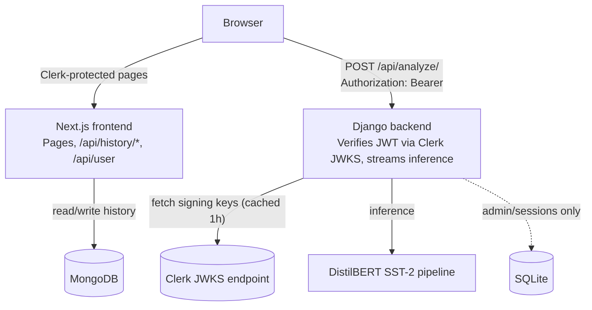

# Sentiment Analyzer


A full-stack sentiment analysis app. Submit text and get back **streamed, word-by-word sentiment scoring** from a DistilBERT model, rendered as an interactive D3 line/area chart plus a confidence donut, with per-user analysis history persisted in MongoDB and Clerk auth enforced end-to-end — including on the inference endpoint itself.

---

## Table of Contents

1. [Overview](#overview)
2. [Architecture](#architecture)
3. [Tech Stack](#tech-stack)
4. [Project Structure](#project-structure)
5. [Prerequisites](#prerequisites)
6. [Getting Started](#getting-started)
7. [API Reference](#api-reference)
8. [Troubleshooting](#troubleshooting)
9. [Testing](#testing)
10. [Known Issues](#known-issues)
11. [License](#license)

---

## Overview

The user types text into the prompt box. The frontend calls the Django backend **directly** (not proxied through Next.js) with a Clerk-issued bearer token. Django verifies that token itself, runs the text through a HuggingFace sentiment pipeline — once for the full sentence, once batched across every word — and streams the results back as plain text, one line at a time, so the UI can render a live "processing" feed as tokens arrive. Once the stream ends, the frontend parses it into structured data and hands it to a D3 visualization (an animated confidence line/area chart plus a donut breakdown), while asynchronously saving the prompt/response pair to MongoDB for the session-history sidebar.

**Key properties:**
- Inference is **authenticated** — `/api/analyze/` is not an open endpoint.
- Inference is **rate-limited and input-capped** server-side, independent of any client-side limits.
- Product data (users, history) lives entirely in MongoDB, owned by the Next.js layer — Django never touches it.

## Architecture

The browser holds **two independent connections**; it does not route through Next.js to reach Django.



**Client → backend.** `components/response/SentimentAnalyzer.tsx` does a client-side `fetch()` straight to `NEXT_PUBLIC_API_URL` (Django), attaching `Authorization: Bearer <token>` from Clerk's `useAuth().getToken()`. This is why CORS must be configured on the Django side, and why the non-simple `Authorization` header triggers a browser preflight (`OPTIONS`) that `django-cors-headers` handles.

**Backend auth is real, not decorative.** `api/authentication.py` implements `ClerkJWTAuthentication`, a DRF authentication class that:
- Pulls the bearer token off `Authorization`.
- Resolves the signing key from Clerk's JWKS endpoint (`{CLERK_ISSUER}/.well-known/jwks.json`), cached in-process for 1 hour, with a one-time forced refetch if the token's `kid` isn't found (handles key rotation without a restart).
- Verifies the RS256 signature, issuer, and required claims (`exp`, `iat`, `sub`) via PyJWT.
- Wraps the Clerk user id in a minimal `ClerkUser` shim (`is_authenticated = True`) so DRF's `IsAuthenticated` — the project-wide default in `settings.py` — works without a real Django `User` row.

A missing, malformed, expired, or badly-signed token is rejected with `401` before the view body runs.

**Django is stateless with respect to product data.** `api/models.py` is empty; Django never touches MongoDB. Its SQLite database only holds Django's own internal tables (admin, sessions) — and even those aren't durable across restarts unless `DJANGO_SECRET_KEY` is pinned. All history and user records live in **MongoDB**, written by the Next.js API routes (`/api/history/*`) via Mongoose. Django's sole job is: verify the caller, run inference, stream the result.

## Tech Stack

**Frontend**
| Library | Version | Purpose |
|---|---|---|
| Next.js | 15.0.3 (App Router, Turbopack dev) | Framework |
| React | 19.0.0-rc | UI |
| TypeScript | 5 | Type safety |
| `@clerk/nextjs` | ^6.9.5 | Auth for the app *and* the token attached to backend calls |
| Mongoose / MongoDB driver | ^8.9.0 / ^6.12.0 | History persistence |
| D3.js | ^7.9.0 | Visualization |

**Backend**
| Library | Version | Purpose |
|---|---|---|
| Django | 5.1.4 | Web framework |
| Django REST Framework | 3.15.2 | API layer, throttling, permissions |
| PyJWT + cryptography | 2.10.1 / 43.0.3 | Verifying Clerk JWTs against JWKS |
| django-cors-headers | 4.6.0 | CORS, incl. `Authorization` preflight |
| Transformers | 4.47.1 | ML pipeline |
| PyTorch (CPU build) | 2.5.1+cpu | Model inference backend |
| Gunicorn | 23.0.0 | Production WSGI server (Docker only — `runserver` stays local-dev-only) |

**Infra**
- Nix flakes for reproducible dev shells (`nix develop`)
- Docker + Docker Compose — both Dockerfiles pin Node 20 / Python 3.11 to match the Nix flake; each service ships a `.dockerignore` so `node_modules`, `__pycache__`, `db.sqlite3`, and `.env*` never land in an image
- Model: [`distilbert-base-uncased-finetuned-sst-2-english`](https://huggingface.co/distilbert-base-uncased-finetuned-sst-2-english)

## Project Structure

```text
sentiment-analyzer/
├── flake.nix / flake.lock       # Nix dev shells: default, frontend, backend, fullstack
├── docker-compose.yml
│
├── sentiment-analyzer-frontend/
│   ├── .dockerignore
│   ├── app/
│   │   ├── (auth)/               # sign-in, sign-up — public routes
│   │   ├── (root)/page.tsx       # main app shell
│   │   ├── api/
│   │   │   ├── user/route.ts
│   │   │   └── history/
│   │   │       ├── fetch-user-history/route.ts
│   │   │       └── create-history-obj/route.ts
│   │   ├── context/GlobalStateContext.tsx
│   │   └── types/sentiment.ts
│   ├── components/
│   │   ├── d3/Visualization.tsx
│   │   ├── forms/PromptInput.tsx
│   │   ├── history/              # Response.tsx, SessionView.tsx
│   │   ├── response/SentimentAnalyzer.tsx   # attaches Clerk bearer token to the Django call
│   │   ├── shared/                # Topbar.tsx, Leftbar.tsx
│   │   └── layout/ClientLayout.tsx
│   ├── lib/
│   │   ├── actions/               # history.action.ts, user.action.ts
│   │   ├── models/                # history.model.ts, user.model.ts (Mongoose)
│   │   ├── parseSentiment.ts
│   │   └── mongoose.ts
│   ├── middleware.ts              # Clerk route protection
│   └── Dockerfile
│
└── sentiment-analyzer-backend/
    └── sentiment-analyzer-backend/   # ⚠ nested — same name twice, see note below
        ├── .env                       # CLERK_ISSUER, DJANGO_ALLOWED_HOSTS, CORS_ALLOWED_ORIGINS, DJANGO_SECRET_KEY
        ├── .dockerignore
        ├── entrypoint.sh              # runs migrations, then launches Gunicorn
        ├── api/
        │   ├── authentication.py      # ClerkJWTAuthentication — verifies bearer tokens via JWKS
        │   ├── views.py               # /api/analyze/ — auth + throttle + length check + streaming
        │   ├── tests.py                # unit tests, Clerk auth mocked
        │   └── urls.py
        ├── sentiment_analyzer_backend/   # note: underscores, not hyphens
        │   ├── settings.py            # REST_FRAMEWORK auth/permission/throttle defaults live here
        │   └── wsgi.py / asgi.py / urls.py
        ├── manage.py                  # loads .env via python-dotenv before Django boots
        ├── requirements.txt
        └── Dockerfile
```

> **Nesting note:** the backend directory contains itself twice (`sentiment-analyzer-backend/sentiment-analyzer-backend/`). `manage.py` lives in the **inner** folder — if you get "can't open file manage.py", you're one directory too shallow.

## Prerequisites

- **Node.js 20** (LTS — matches the Nix flake and the frontend Docker image)
- **Python 3.11** (matches the Nix flake and the backend Docker image)
- A **MongoDB** instance (Atlas or self-hosted) for history storage
- A **Clerk** application — you need its publishable/secret keys (frontend) **and** its issuer URL (backend, for JWT verification)
- **Nix** (optional, recommended — this repo ships a flake) or **Docker** (optional, for a fully containerized run)

## Getting Started

### 1. Environment variables

Django reads config directly from `os.environ`; `manage.py` loads a `.env` next to it via `python-dotenv` before Django boots (Docker/Nix supply these directly instead). The frontend follows normal Next.js convention and picks up `.env.local` automatically.

**Backend** (`sentiment-analyzer-backend/sentiment-analyzer-backend/.env`):

| Variable | Required | Default | Notes |
|---|---|---|---|
| `CLERK_ISSUER` | **Yes** | — | e.g. `https://your-app.clerk.accounts.dev`. Read with `os.environ["CLERK_ISSUER"]` — no fallback, so **Django raises `KeyError` at startup if unset**. Used to build the JWKS URL. |
| `DJANGO_SECRET_KEY` | Recommended | random key regenerated every process start if unset | Doesn't affect `/api/analyze/` (JWT-verified, not session-based), but pin it for `/admin/` — a rotating key breaks sessions/CSRF across restarts. |
| `DJANGO_DEBUG` | No | `False` | Set `True` for local dev (see [Troubleshooting](#troubleshooting)) |
| `DJANGO_ALLOWED_HOSTS` | If `DEBUG=False` | empty | Comma-separated hostnames |
| `CORS_ALLOWED_ORIGINS` | No | empty (allow-all if `DEBUG=True`) | Comma-separated origins |

**Frontend** (`sentiment-analyzer-frontend/.env.local`):

| Variable | Required | Default | Notes |
|---|---|---|---|
| `MONGODB_URL` | Yes | — | Connection string for history storage |
| `NEXT_PUBLIC_CLERK_PUBLISHABLE_KEY` | Yes | — | Clerk client-side key |
| `CLERK_SECRET_KEY` | Yes | — | Clerk server-side key |
| `NEXT_PUBLIC_API_URL` | No | `http://127.0.0.1:8000/api/analyze/` | Where Django is running. Inlined into the client bundle at **build time** — treat it as public, not secret. |

### 2. Option A — Nix (recommended)

```bash
nix develop              # full stack (frontend + backend tools)
nix develop .#frontend   # or scope it down
nix develop .#backend
```

Then follow the manual steps below inside the shell.

### 3. Option B — Manual setup

**Backend:**
```bash
cd sentiment-analyzer-backend/sentiment-analyzer-backend
python -m venv env
source env/bin/activate
pip install -r requirements.txt

# torch is intentionally commented out of requirements.txt (it needs the
# CPU-only wheel index, not PyPI) — install it separately or you'll hit
# ModuleNotFoundError: torch
pip install torch==2.5.1+cpu torchvision==0.20.1+cpu torchaudio==2.5.1+cpu \
  --index-url https://download.pytorch.org/whl/cpu

export DJANGO_DEBUG=True
export CLERK_ISSUER=https://your-app.clerk.accounts.dev
python manage.py migrate
python manage.py runserver
```
Runs at `http://127.0.0.1:8000`. The DistilBERT pipeline loads **lazily** on the first request to `/api/analyze/`, not at process start, so `migrate`/`shell` don't pay the model-load cost. (`runserver` is fine here — local dev only. Docker uses Gunicorn.)

**Frontend** (separate terminal):
```bash
cd sentiment-analyzer-frontend
npm install
npm run dev
```
Runs at `http://localhost:3000`.

### 4. Option C — Docker Compose

Create a `.env` at the **repo root**:
```env
# Django backend
CLERK_ISSUER=https://your-app.clerk.accounts.dev
DJANGO_SECRET_KEY=replace-with-a-long-random-string
DJANGO_DEBUG=False
DJANGO_ALLOWED_HOSTS=sentiment-backend,localhost
CORS_ALLOWED_ORIGINS=http://localhost:3000

# Next.js frontend
MONGODB_URL=mongodb+srv://<user>:<password>@<cluster>/<db>
NEXT_PUBLIC_CLERK_PUBLISHABLE_KEY=pk_test_xxxxxxxx
CLERK_SECRET_KEY=sk_test_xxxxxxxx
```
Then:
```bash
docker-compose up --build
```
`docker-compose.yml` passes `CLERK_ISSUER` through to the `sentiment-backend` service's `environment:` block, so Django's `os.environ["CLERK_ISSUER"]` resolves correctly as long as it's set in the root `.env` above.

`NEXT_PUBLIC_*` vars are inlined by Next.js at **build time**; the compose file passes them as build `args`, so the frontend image bakes in correct values as long as the root `.env` is populated *before* `docker-compose up --build` runs.

The backend container runs `entrypoint.sh`, which applies migrations then serves via **Gunicorn** (2 workers, 120s timeout — generous for CPU-bound inference on longer inputs).

## API Reference

| Method | Route | Service | Auth | Description |
|---|---|---|---|---|
| `POST` | `/api/analyze/` | Django `:8000` | Clerk JWT, verified server-side against JWKS | Streams sentiment analysis. Throttled 20 req/min per caller; rejects text over 5,000 chars with `400` before touching the model. |
| `GET` | `/api/user` | Next.js | Clerk (session) | Ensures the signed-in user exists in MongoDB |
| `GET` | `/api/history/fetch-user-history` | Next.js | Clerk (session) | Returns the current user's saved history |
| `POST` | `/api/history/create-history-obj` | Next.js | Clerk (session) | Saves a prompt/response pair to history |

### `POST /api/analyze/`

**Headers:**
```
Authorization: Bearer <Clerk session JWT>
Content-Type: application/json
```

**Request:**
```json
{ "text": "I absolutely love this project" }
```

`401` → missing/invalid token. `400` → missing `text`, or `text` over 5,000 characters.

**Response** — `text/plain`, streamed, one result per line. Confidence values are full-precision floats, not rounded:
```
I - Sentiment: POSITIVE - Confidence: 0.8734182119369507
absolutely - Sentiment: POSITIVE - Confidence: 0.9912316799163818
love - Sentiment: POSITIVE - Confidence: 0.9987106323242188
this - Sentiment: NEUTRAL - Confidence: 0.6221340298652649
project - Sentiment: NEUTRAL - Confidence: 0.7100392580032349

-Overall- Sentiment: POSITIVE - Confidence: 0.9945602416992188
```
The overall-sentence result is computed once up front; per-word results are one **batched** pipeline call (not one call per word), streamed out sequentially to preserve the line-by-line UI effect. If inference fails mid-stream — after headers are already sent — the generator catches the exception and yields `[error] Analysis interrupted.` instead of leaking a raw traceback into the response body.

## Troubleshooting

**`KeyError: 'CLERK_ISSUER'` on Django startup**
`CLERK_ISSUER` isn't set. Export it locally, add it to the backend `.env`, or (for Docker Compose) add it to the root `.env` file — the compose file already passes it through to the container.

**`401 Unauthorized` from `/api/analyze/`**
Either the frontend never attached a bearer token (a stale or signed-out Clerk session returns `null` from `getToken()`), the token expired, or the backend's `CLERK_ISSUER` points at a different Clerk instance than the one issuing the frontend's tokens.

**`CommandError: You must set settings.ALLOWED_HOSTS if DEBUG is False`**
`manage.py runserver` run manually without `DJANGO_DEBUG` exported — it defaults to `False`, which requires `DJANGO_ALLOWED_HOSTS`. Fix: `export DJANGO_DEBUG=True` locally. (Docker Compose doesn't hit this — it defaults `DJANGO_ALLOWED_HOSTS` already.)

**`ModuleNotFoundError: No module named 'torch'`**
`requirements.txt` deliberately comments out `torch`/`torchvision`/`torchaudio` since they need PyTorch's CPU-only wheel index, not PyPI. Install them separately — see [Option B](#3-option-b--manual-setup).

**Can't find `manage.py`**
You're in the outer `sentiment-analyzer-backend/` folder — descend one more level to the inner one.

**Clerk publishable key blank, or auth breaks only in the Docker build**
Confirm the root `.env` actually has `NEXT_PUBLIC_CLERK_PUBLISHABLE_KEY` set *before* `docker-compose up --build` — it's a Dockerfile `ARG` baked in at build time, so setting it after the image is built won't help; rebuild.

**First request after a fresh backend start is slow**
Expected — the DistilBERT pipeline loads on the first call to `/api/analyze/`, not at process start. Subsequent requests reuse the cached pipeline.

**`429 Too Many Requests`**
The `analyze` throttle scope allows 20 req/min per caller. This is a per-process, in-memory throttle (DRF's default cache backend) — it resets on restart and isn't shared across multiple Gunicorn workers/replicas (see [Known Issues](#known-issues)).

## Testing

Backend tests live in `api/tests.py` and mock both the ML pipeline (`get_sentiment_analyzer`) and `ClerkJWTAuthentication.authenticate`, so they run in milliseconds without downloading model weights or hitting Clerk's JWKS endpoint:

```bash
cd sentiment-analyzer-backend/sentiment-analyzer-backend
python manage.py test
```

Coverage: missing-input validation (`400`), over-length input (`400`), and the streamed success path (per-word lines + the trailing `-Overall-` line). No frontend tests are set up yet.

## Known Issues

**Correctness / scaling:**
- **In-memory throttle doesn't scale past one worker** — `ScopedRateThrottle`'s default cache backend is per-process. With Gunicorn's 2 workers (or any horizontal scaling), the effective limit is closer to `20 × worker_count`/min, not a global 20/min. Needs a shared cache (Redis/Memcached).
- **History writes are fire-and-forget** — `SentimentAnalyzer.tsx` posts to `/api/history/create-history-obj` with `.catch(console.error)` and never surfaces failures to the user; an analysis can render successfully while silently failing to save.
- **`DJANGO_SECRET_KEY` regenerates every restart if unset** — harmless for the JWT-verified `/api/analyze/` path, but breaks session/CSRF continuity for `/admin/` across deploys.
- **Single SQLite file for Django's own tables** — fine at this scale; multiple backend replicas behind a load balancer would need Postgres (already available, unused, in the Nix shells).

**Cosmetic / hygiene:**
- **Nested backend directory naming** (`sentiment-analyzer-backend/sentiment-analyzer-backend/`) — confusing but non-blocking; collapsing it means updating `docker-compose.yml`'s build context and every path reference.
- **`flake.nix`'s `packages.frontend` derivation points at `./sentiment-analyzer`**, but the actual directory is `sentiment-analyzer-frontend/` — the Nix build package target is currently stale relative to the real folder name.
- **`manage.py`'s `.env.local` → `.env` fallback is a no-op** — both `env_local` and `env_standard` resolve to the same `base_dir / ".env"` path, so the "try `.env.local` first" comment doesn't reflect what the code does.
- **No CI pipeline** — `api/tests.py` exists but nothing runs it automatically on push/PR.
- **No license file** — add one (MIT, Apache-2.0, etc.) to clarify usage terms.

---

## License

No license has been specified yet. Add a `LICENSE` file to clarify how others may use this code.
